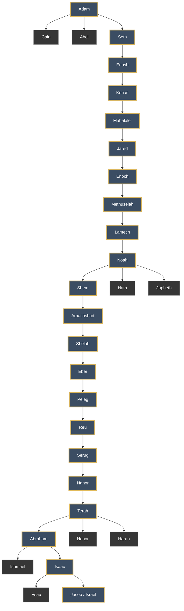

# Genealogy — Adam to Jacob

> [!info] Genealogical Line
> This chart follows the main genealogical line from Adam to Jacob while also showing several important side branches recorded in Genesis.

## Main Genealogy Passages

- **Genesis 4** — Cain, Abel, and Seth
- **Genesis 5** — Adam to Noah
- **Genesis 10** — Descendants of Noah
- **Genesis 11:10–26** — Shem to Terah
- **Genesis 11:27–32** — Family of Terah
- **Genesis 16–21** — Ishmael and Isaac
- **Genesis 25** — Esau and Jacob

## Main Line

**Adam → Seth → Enosh → Kenan → Mahalalel → Jared → Enoch → Methuselah → Lamech → Noah → Shem → Arpachshad → Shelah → Eber → Peleg → Reu → Serug → Nahor → Terah → Abraham → Isaac → Jacob**